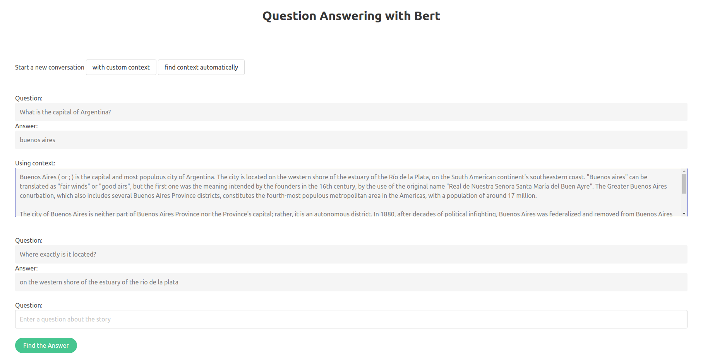

# One-Shot-CQA-with-GPT3

Code for our NLP course research paper: 

We investigated the ability of neural models to understand and answer questions with respect to some context, i.e., with respect to previously asked questions and their answers about a given passage. Then we used the learnt model to feed the bigger GPT-3 model (350M parameters) with in-context samples from the training set when queried about a new one.
We propose a method for inferencing with GPT-3 in the conversational question answering task and show that the best results are obtained mostly when using the model that was fine-tuned for that task. We also show the superiority of our method among 2 naive ones, which chose samples randomly as the context sample that's fed to GPT-3.

<p align="center"></p>

We've also built a retrivel module based on the TD-IDF algorithm together with an API for a convienient use.

For setup:

```
git clone https://github.com/ilanmotiei/One-Shot-CQA-with-GPT3.git
cd One-Shot-CQA-with-GPT3
pip3 install -r requirements.txt
```

For using the retrieval-reader web api:

First download the pretrained model and the data from here: https://drive.google.com/drive/folders/16eAi3j2XOrdMVs3oCnzwSx1GBFLgNTDn?usp=sharing.
Donwload all the files and place them in the root directory of the repository.

Then, execute the following command:
```
python3 api/api.py --model model.pth --args args.pth --data coqa-dev-v1.0.json
```

The api should look like this:

<p align="center"></p>

Have fun!


